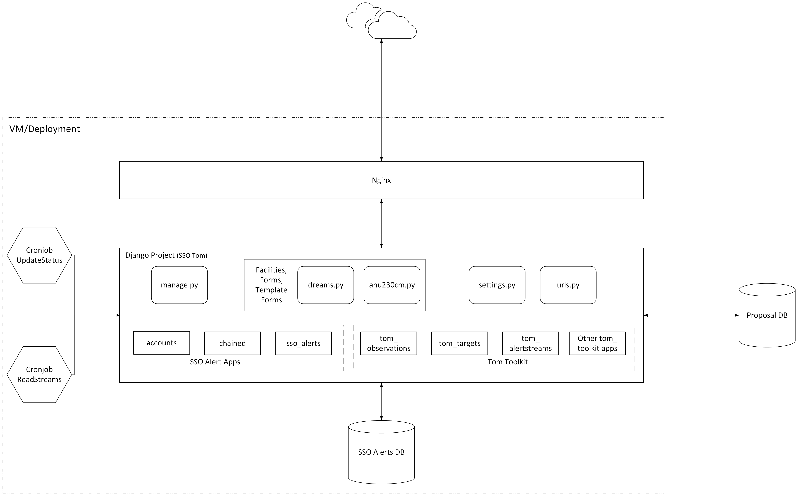

## Diagram Description

The diagram represents the main services and interactions in the application. This setup includes three core components:
**Nginx Proxy Manager**, **Django Application**, and **PostgreSQL Database**. Each component plays a critical role in
the application’s functionality.

### 1. **Nginx Proxy Manager**

- **Description**: This service acts as a reverse proxy, managing external HTTP and HTTPS requests to the application.
  It also handles SSL certificates through Let's Encrypt, ensuring secure connections.
    - Listens on ports 80 (HTTP), 443 (HTTPS), and 81 (for Nginx management interface).
    - Routes incoming traffic to the Django application based on defined proxy rules.

### 2. **Django Application**

- **Description**: This is the main application service. It connects to the other resources including the PostgreSQL
  database and provides the core functionality of the app.
    - Interacts with Nginx Proxy Manager to handle requests routed from the internet.
    - Communicates with the PostgreSQL database to read and write application data.
    - Leverages the functionalities provided by the tom toolkit apps (Can be viewed
      at [tom demo site](https://tom-demo.lco.global/)). On top of that, it has got its own (custom) apps to support
      additional features and customised functionality requests.
    - Hosts two custom facility classes (DREAMS, ANU230cm) to make queries to those facilities and submit observations.
      For details on how to add facility to TOM, please see
      [writing an observation module](https://tom-toolkit.readthedocs.io/en/latest/observing/observation_module.html).

### 3. **PostgreSQL Database**

- **Description**: This service provides a persistent database to store application data.
    - Accepts connections from the Django application to manage and retrieve data.
    - Stores data persistently in the `postgresql/data` directory. This includes all tables, records, and schema
      information necessary for application functionality.

### Summary

This component setup enables the application to serve users securely via Nginx, interact with a PostgreSQL database for
data management, and isolate each component for better scalability and maintainability.

## Workflow for Future Modifications

The project is set up as an extension to the **TOM Toolkit** (a Django-based project), retaining all applicable
functionalities of TOM while introducing new features through custom applications. ADACS developers have added three new
Django apps to meet specific requirements outlined in the design document.

To accommodate future modification requests, the following steps were taken by ADACS developers and can serve as a
guideline for future updates:

1. **Feature/Extension Assessment**  
   Each feature or extension request is evaluated to determine whether it can be fulfilled using existing TOM Toolkit
   capabilities.

2. **Implementation Paths**
    - **If TOM Features Are Sufficient**: Make necessary adjustments within the Django templates (HTML, CSS, JS) if
      needed.
        - **Example**: Updating the `observation_form.html` file for front-end
          customizations ([see example template](sso_tom/templates/tom_observations/observation_form.html)).

    - **If New Functionality Is Required**:
        - **Extending Existing Views**: When some TOM Toolkit functionalities are applicable, consider extending the
          Django views in the custom Django app.
            - **Example**: Customizing view logic
              in `views.py` ([see reference](sso_tom/sso_tom/views.py)).
        - **Implementing as a New Feature**: If no TOM Toolkit components can be leveraged, develop the feature
          independently within the custom app.
            - **Example**: Building new views from scratch for unique
              features ([see reference](sso_tom/sso_alerts/views.py)).

By following these steps, future modifications can be efficiently managed while preserving TOM’s core functionalities
and integrating custom extensions.
